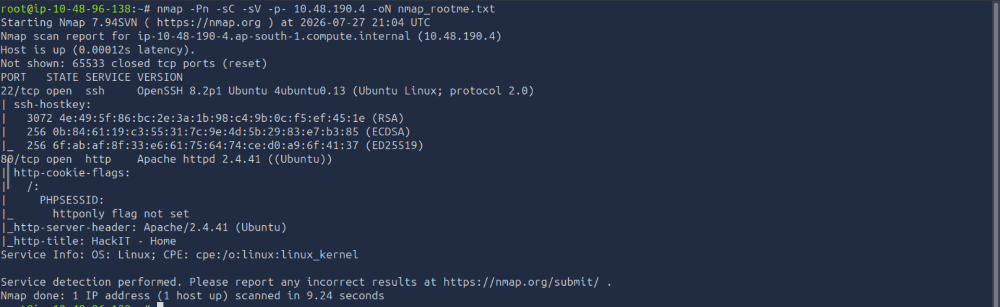
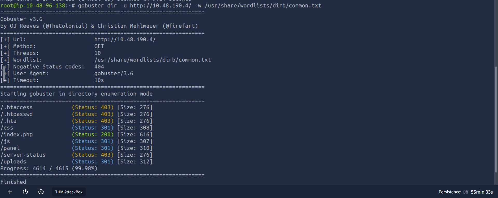
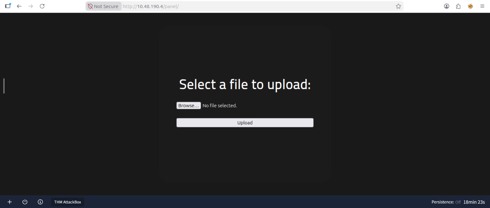

# TryHackMe - RootMe Penetration Testing Report

## Objective

--------------
## Scope
 - Platform: TryHackMe
 - Room: RootMe
 - Target: Virtual Machine

 --------

 ## Methodology
 1. Reconnaissance
 2. Enumeration
 3. Initial Acess
 4. Privilege Escalation
 5. Post Exploitation
 
 --------

 # Phase 1 - Reconnaissance
 ## Objective 
 The objective of this assessment was to identify open ports, running services, and potential attack vectors on the target machine.
 ## Nmap Scan
 **Command**
 ```bash
nmap -Pn -sC -sV -p- <TARGET_IP> -oN nmap_rootme.txt
```


### Results

The nmap scan identified two open TCP ports:
| Port   | Service  | Version            |
|--------|----------|--------------------|
| 22     | SSH      | OpenSSH            |
| 80      | HTTP     | Apache httpd 2.4.42|

### Analysis
The target exposes an SSH service on port 22 and a web sever on port 80. Since SSH requires valid credentials, the web server presents the most promising initial attack surface. The next phase will focus on enumerating the web application to identify hidden directories, files, and potential vulnerabilities.

 # Phase 2 - Enumeration
 ### Findings
 Gobuster identified several accessible directories and files on the web server.
 | path        |    Status        |  Description                    |
 |-------------|------------------|---------------------------------|
 |  /.htaccess |          403     | Restricted                      |
 |  /.htpasswd |          403     | Restricted                      |
 |  /.hta      |          403     | Restricted                      |
 |  /css       |          301     | CSS Directory                   |
 |  /index.php |          200     | Main Web Application            |
 |  /js        |          301     | JavaScript Directory            |
 |   /panel    |          301     | Potential file upload           |
 |  /server-status |      403     | Apache status page(restricted)  |
 |  /uploads      |       301     | Uploads directory               |

 The `/panel/` and `/uploads` directories appear to be the most promising targets for further investigation.

 ### Analysis
 Directory enumeration revealed an upload panel (`/panel`) and an uploads directory (`/uploads`). These may allow file uploads and could potentially be exploited to gain remote code execution if file type validation is insufficient.
 
 

 ### Upload Panel

 The `/panel` endpoint presented a file upload form, indicating that users can upload files to the web server. Combined with the discovery of the `/uploads` directory, this suggests a possible file upload vulnerability that may be leveraged for remote code execution.

 


 # Phase 3 - Initial Access


 # Phase 4 - Privilege Escalation

----------
 # Tools Used
  - Nmap
  - Gobuster / FFUF
  - Netcat
  - Bash
  - GTOBins

  -----------

  # Recommendations

  
 
